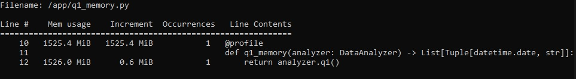
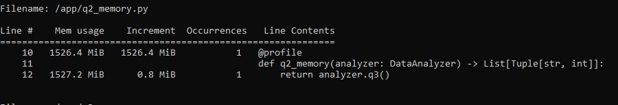
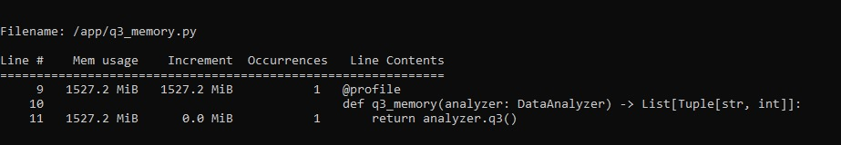
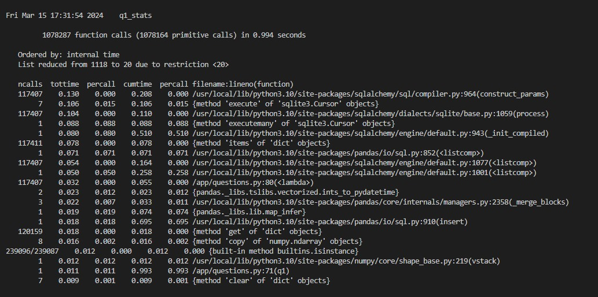
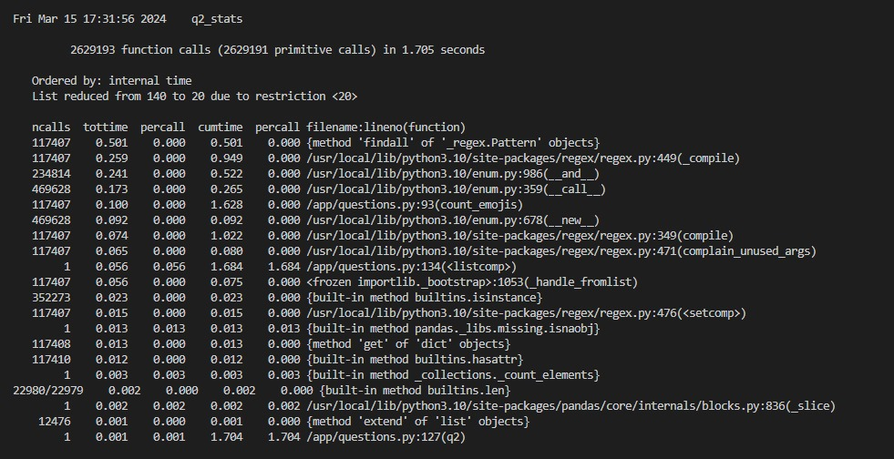
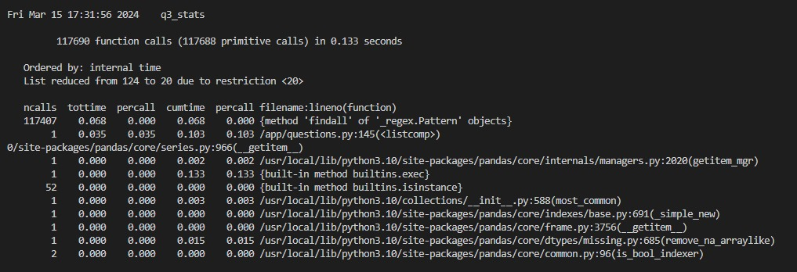

# matheushrd-challenge_de_latam

# Challenge Data Engineer LATAM

Project to data engineer skill and knowledge demonstration:

    * Python and software architeture
    * Data Analysis with Python
    * SQL
    * Terraform
    * AWS
  
## How to Run:

### Windows CMD: `cd src && run_docker.bat`

### Windows Powershell: `cd src && run_docker.ps1`

### Windows WSL/Linux: `cd src && run_docker.sh`


## Cloud Architeture

This architectural proposal consists of:

    * Create a repository in AWS ECR containing the docker image build
    * Run this build in an AWS ECS Fargate task
    * Notify in an SNS topic (and after send an e-mail, etc.)
    * Write logs to AWS Cloudwatch


# Results

## Answer Q1

```python
[(datetime.date(2021, 2, 24), 'preetysaini321'), (datetime.date(2021, 2, 24), 'AhluwaliaA2'), (datetime.date(2021, 2, 24), 'JBBal75'), (datetime.date(2021, 2, 24), 'rumsomal'), (datetime.date(2021, 2, 24), 'ajityadavdu'), (datetime.date(2021, 2, 24), 'MaanDee08215437'), (datetime.date(2021, 2, 24), 'shells_n_petals'), (datetime.date(2021, 2, 24), 'MalikAvni'), (datetime.date(2021, 2, 24), 'Sangha_jass11'), (datetime.date(2021, 2, 24), 'jas04361527')]
```
## Answer Q2

```python
[('🙏', 7286), ('😂', 3072), ('️', 3061), ('🚜', 2972), ('✊', 2411), ('🌾', 2363), ('🇮', 2096), ('🇳', 2094), ('🏻', 2080), ('❤', 1779)]
```
**Note**: In Q2 I used all patterns that identify an emoji. Therefore, it is possible to observe the occurrence of bitmaps, not only colored emojis.

## Answer Q3

```python
[('narendramodi', 2261), ('Kisanektamorcha', 1836), ('RakeshTikaitBKU', 1639), ('PMOIndia', 1422), ('RahulGandhi', 1125), ('GretaThunberg', 1046), ('RaviSinghKA', 1015), ('rihanna', 972), ('UNHumanRights', 962), ('meenaharris', 925)]
```
## Memory Q1


## Memory Q2


## Memory Q3


## Time Q1


## Time Q2


## Time Q3



# Hardware And Sofware

    * Windows 11 64 bits
    * WSL v2.0 (Ubuntu-22.04)
    * Processor AMD Ryzen 5 5600G with Radeon Graphics 3.90 GHz
    * RAM 40,0 GB

